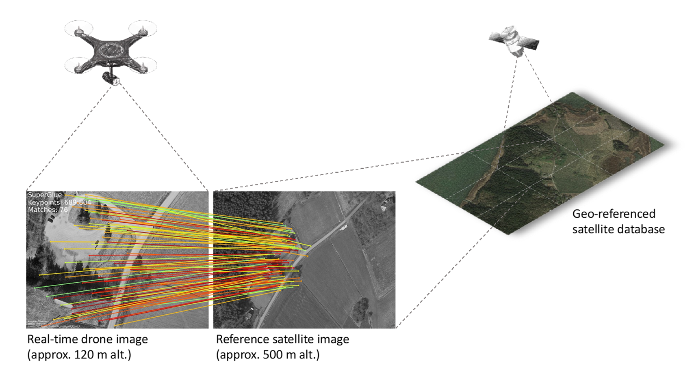
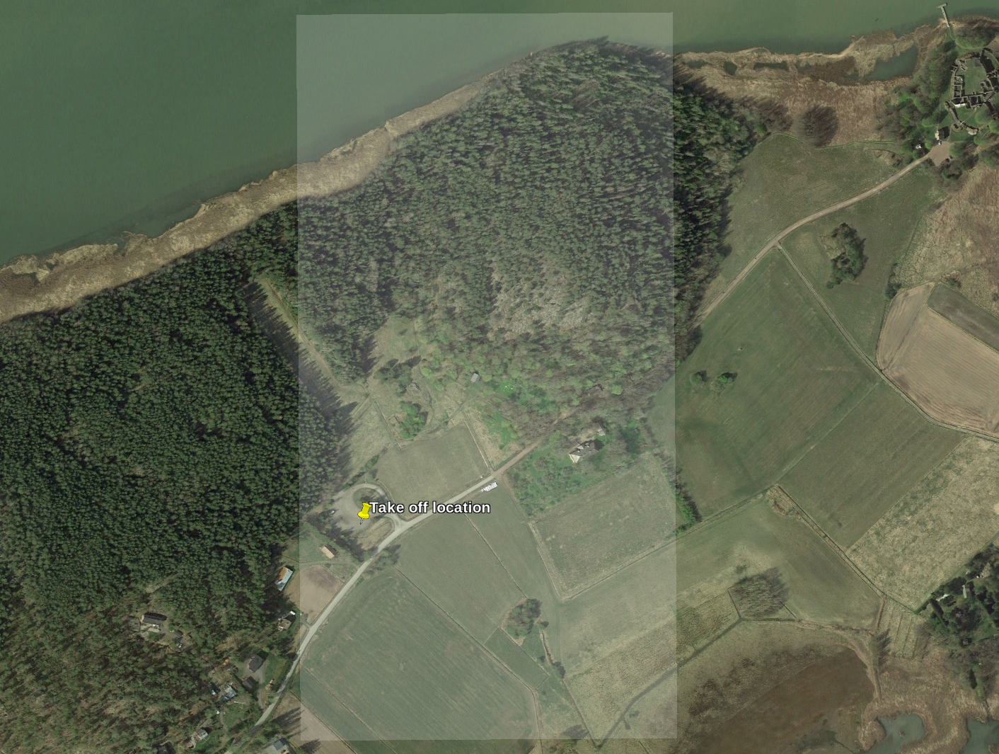
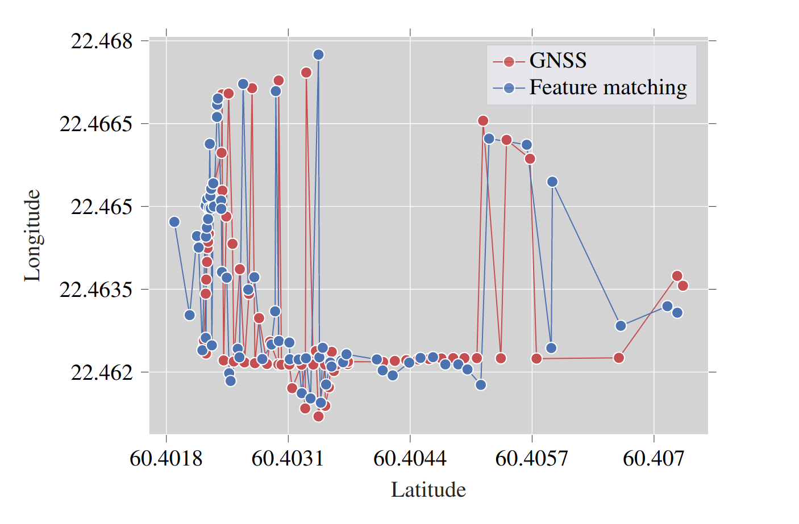
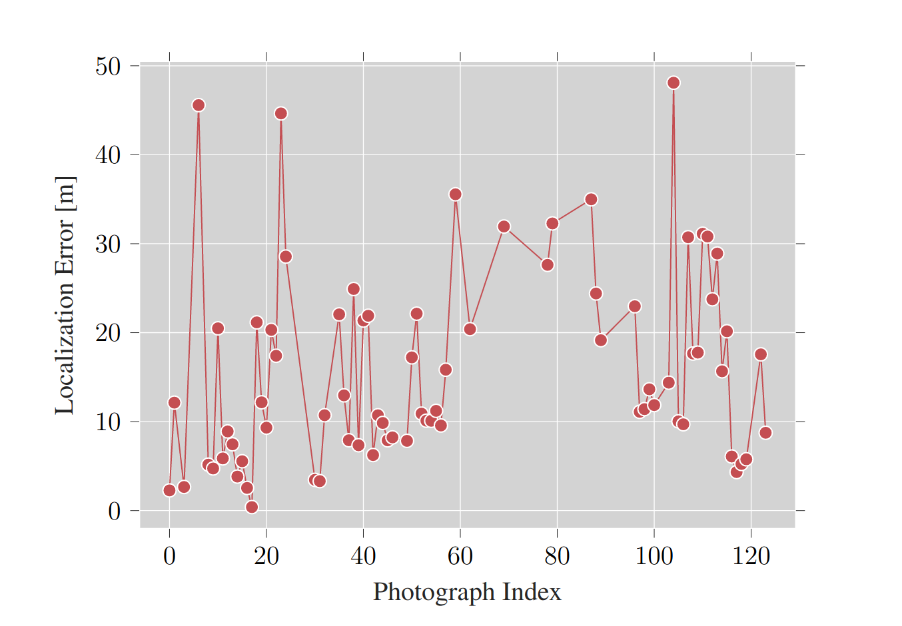
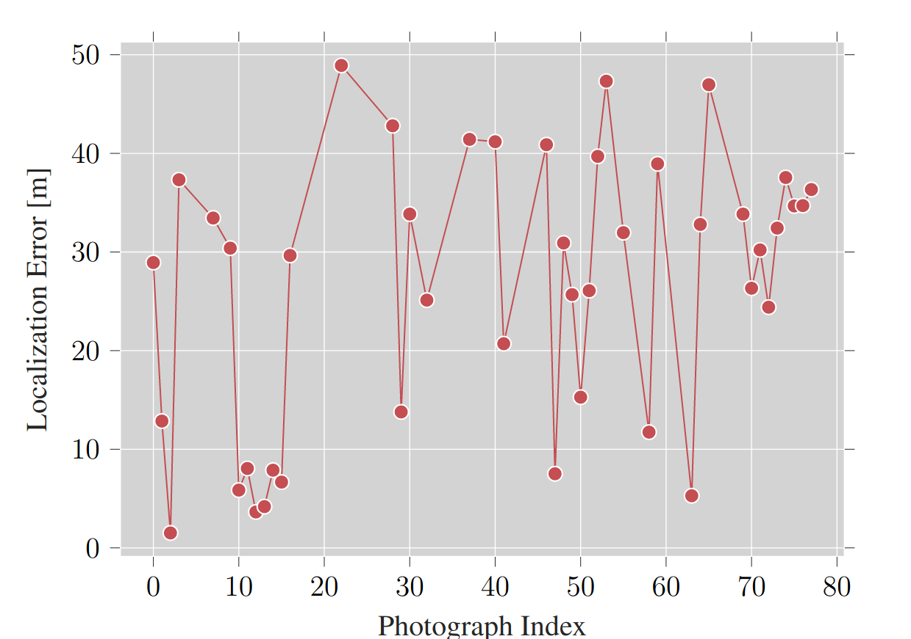
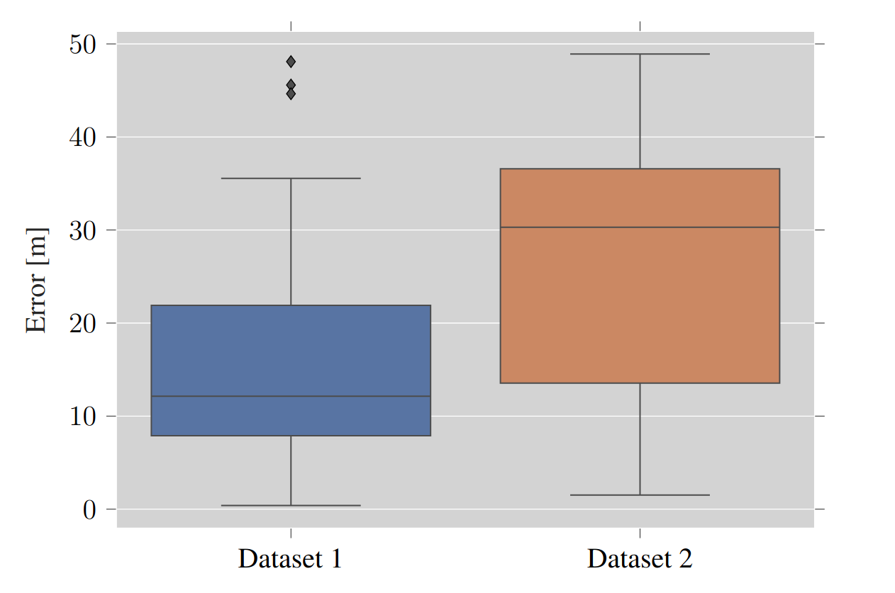

# WildNav: GNSS-Free drone navigation and localization in the wild

###  Abstract

Considering the accelerated development of Unmanned Aerial Vehicles (UAVs) applications in both industrial and research scenarios, there is an increasing need for localizing these aerial systems in non-urban environments, using GNSS-Free, vision-based methods. Our paper proposes a vision-based localization algorithm that utilizes deep features to compute geographical coordinates of a UAV flying in the wild. The method is based on matching salient features of RGB photographs captured by the drone camera and sections of a pre-built map consisting of georeferenced open-source satellite images. Experimental results prove that vision-based localization has comparable accuracy with traditional GNSS-based methods, which serve as ground truth. Compared to state-of-the-art Visual Odometry (VO) approaches, our solution is designed for long-distance, high-altitude UAV flights.

### Algorithm Overview

<div align=center>

<p align="center">Vision-based localization algorithm overview </p>
</div>

<div align=center>

<p align="center">Examples of successfully matched drones photographs (left) and satellite
images (right) </p>
</div>


## How to run

   0. [Highly recommended) Create a new python3 virtual environment
      ```
      python3 -m venv env 
      source env/bin/activate # activate the virtual env
      which python3 # output should be ~/env/bin/python3
      ```
   1. Clone repo
      ```
      git clone git@github.com:TIERS/wildnav.git
      ```
   3. Install superglue dependencies:
      ```
      git submodule update --init --recursive
      ```
   3. Install python dependencies
      ```
      pip3 install -r requirements.txt
      ```
   4. Run
      ```
      cd src
      python3 feature_matching_superglue.py
      ```


## Add your own drone image dataset
1. Add your drone photos to ```assets/query```. Feel free to use our dataset from [here](https://utufi.sharepoint.com/:f:/s/msteams_0ed7e9/EsXaX0CKlpxIpOzVnUmn8-sB4yvmsxUohqh1d8nWKD9-BA?e=gPca2s).
2. Add your satellite map images to ```assets/map``` together with a csv file containing geodata for the images (see ```assets/map/map.csv```) 
3. Run python script to generate csv file containing photo metadata with GNSS coordinates
   ```
   python3 extract_image_meta_exif.py
   ```
4. Run wildnav algorithm
   ```
   python3 feature_matching_superglue.py
   ```
## Common problems and fixes

1. Runtime error due to incompatible version of ```torch``` installed
Error message: "NVIDIA GeForce RTX 3070 with CUDA capability sm_86 is not compatible with the current PyTorch installation. The current PyTorch install supports CUDA capabilities sm_37 sm_50 sm_60 sm_70.If you want to use the NVIDIA GeForce RTX 3070 GPU with PyTorch."

**Fix:**

Uninstall current torch installation:
```
pip3 uninstall torch
```
Follow instructions on the official [pytorch](https://pytorch.org/get-started/locally/) website to install the right version of torch for your system (it depends on your graphics card and CUDA version).

2. No dedicated GPU available on your system.

**Fix:**


The algorithm can run, albeit much slower, on CPU. Simply change ```force_cpu``` flag in ```src/superglue_utils.py``` to ```True```.


## Datasets

Photographs used for experimental validation of the algorithm can be found [here](https://utufi.sharepoint.com/:f:/s/msteams_0ed7e9/EsXaX0CKlpxIpOzVnUmn8-sB4yvmsxUohqh1d8nWKD9-BA?e=gPca2s).

<div align=center>

<p align="center">Satellite view of the flight zone (highlighted rectangle). The yellow pin is
located at 60.403091° latitude and 22.461824° longitude </p>
</div>


## Results

<div align=center>

|           	| Total 	| Localized 	| MAE (m) 	|
|:---------:	|:-----:	|:---------:	|:-------:	|
| Dataset 1 	|  124  	|  77 (62%) 	|  15.82  	|
| Dataset 2 	|   78  	|  44 (56%) 	|  26.58  	|

</div>


<div align=center>

<p align="center">Dataset 1 absolute coordinates of localized photographs </p>
</div>

<div align=center>

<p align="center">Dataset 1 localization error </p>
</div>

<div align=center>

<p align="center">Dataset 2 absolute coordinates of localized photographs</p>
</div>

<div align=center>

<p align="center">Dataset 2 localization error </p>
</div>

<div align=center>

<p align="center">Error comparison </p>
</div>

## Contact
Feel free to send me an email at mmgurg@utu.fi if you have any questions about the project.
